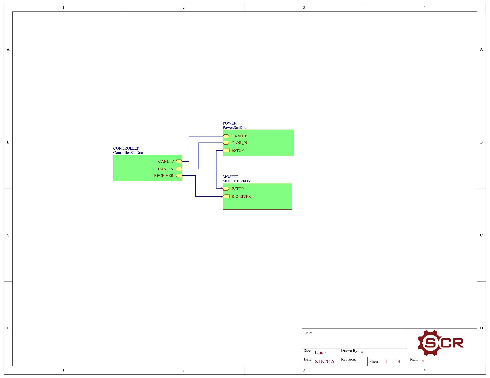
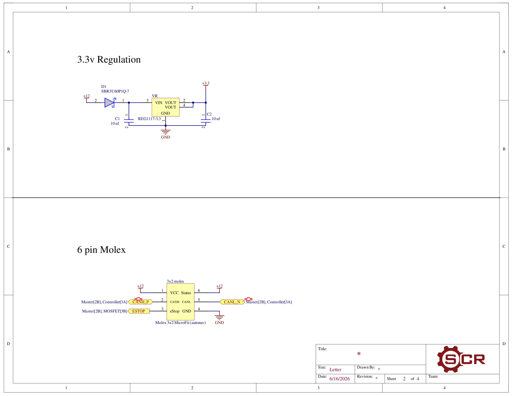
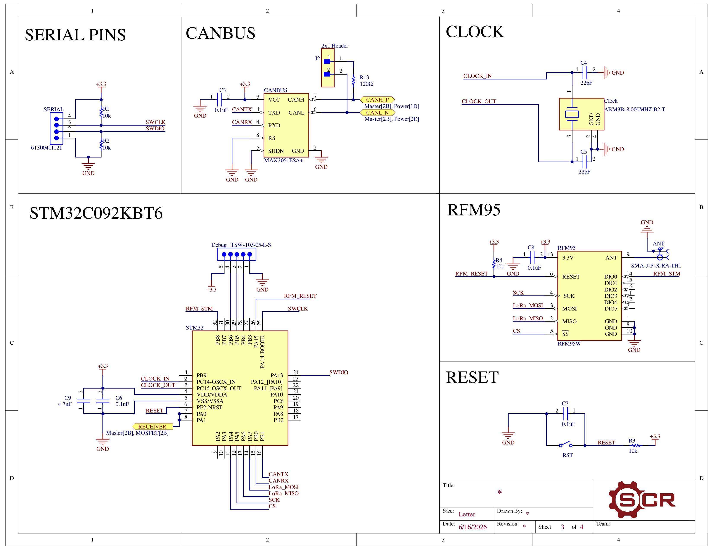
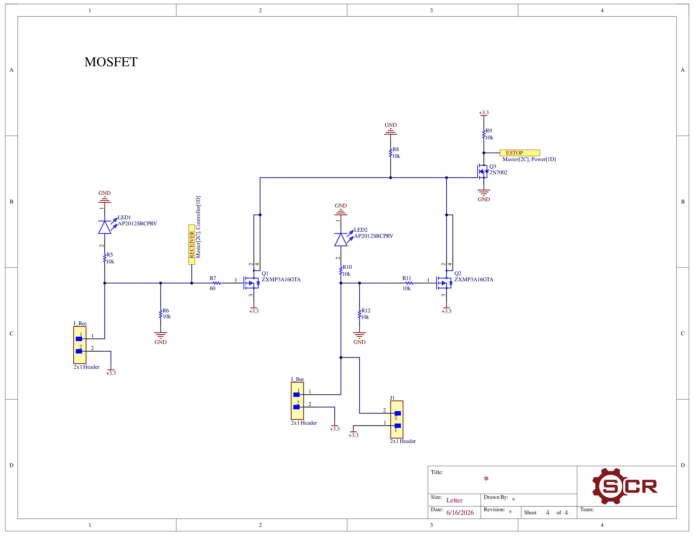
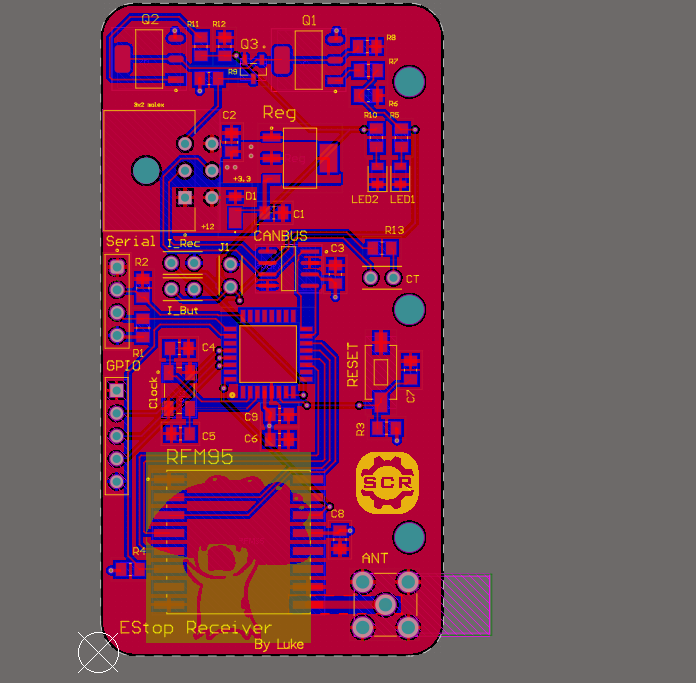
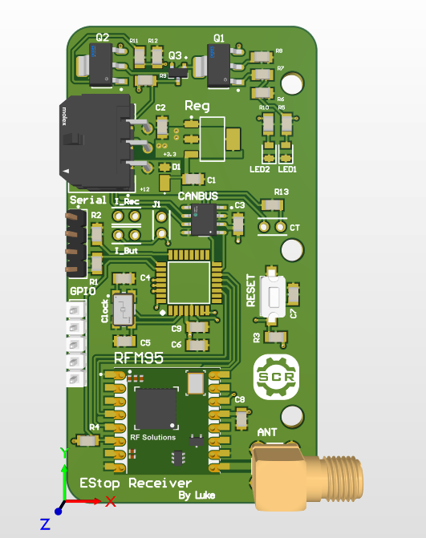

# Emergency Stop Receiver Board
### LoRa-based emergency stop receiver that converts RF commands into CAN messages and a hardware-interlocked MOSFET shutdown path.

A 2-layer PCB designed for Sooner Competitive Robotics' autonomous robot platform. The board receives a wireless emergency-stop signal over LoRa RF and translates it into a CAN bus message and a MOSFET-switched output to safely halt robot operation.

## Overview

Safety-critical robots require a reliable, interference-resistant method to halt all motion on command. This board was designed to replace a more complex multi-board solution with a single compact receiver that handles RF reception, protocol conversion, and power switching in one unit.

## Hardware

| Component | Part | Function |
|-----------|------|----------|
| Microcontroller | STM32C092 | Central processing, CAN and SPI coordination |
| RF Module | RFM95 LoRa | Wireless e-stop signal reception |
| CAN Transceiver | MAX3051 | CAN bus interface to robot subsystems |
| Voltage Regulator | REG1117-3.3 | 12V to 3.3V regulation |
| Output Stage | ZXMP3A16GTA | Safety-critical switched output |

**Board dimensions:** 1.52" × 2.85"  
**Layers:** 2  
**Designed in:** Altium Designer

## Schematic

## PCB Layout

## Board Photo

## Design Decisions

**Hierarchical schematic structure** — the design is split across three sheets (Power, Controller, MOSFET) tied together at the top level, keeping each subsystem readable independently.

**SMA antenna connector** — a panel-mount SMA connector was chosen for the RFM95 to allow a proper external antenna, improving range in an electrically noisy robot environment.

**Separate MOSFET output stage** — the switched output is isolated from the controller stage so a fault in the output circuit cannot affect the microcontroller or RF receiver.

## Bring-Up Notes

Hand-soldered and validated using a bench power supply and multimeter. Hardware faults were encountered during initial bring-up and diagnosed using bench equipment. A backup circuit was implemented to meet competition deadline. The board successfully operated at IGVC 2026 where the team placed 6th out of 22 teams.

## Tools

- Altium Designer
- STM32 ecosystem
- Bench multimeter, oscilloscope, power supply
